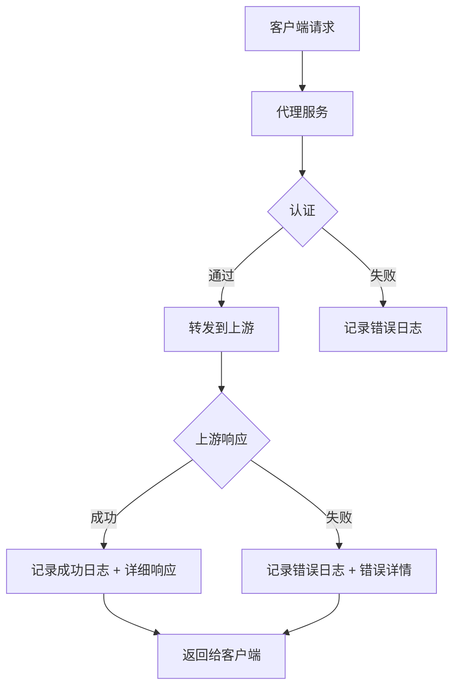

# 详细调用日志 - 技术设计方案

需求名称：detailed-call-logs
更新日期：2026-03-17

## 概述

为 AI API 中转站的调用记录功能增加更详细的日志记录，便于问题排查和审计。

## 现状分析

当前 `ApiLog` 模型仅记录以下字段：
- provider_id、model、api_key_prefix
- input_tokens、output_tokens、total_tokens
- status、latency_ms、created_at

当前日志 API (`GET /logs`) 返回内容：
- id、provider_name、model、api_key_prefix
- input_tokens、output_tokens、total_tokens
- status、latency_ms、created_at

## 需求分析

### 需要新增的日志字段

| 字段 | 说明 | 数据类型 |
|------|------|----------|
| request_summary | 请求提示词摘要 | TEXT |
| response_summary | 响应内容摘要 | TEXT |
| error_message | 错误详情 | TEXT |
| client_ip | 客户端 IP | VARCHAR(45) |
| cache_tokens | 缓存节省的输入 token 数 | INTEGER |
| first_token_latency_ms | 首个 token 耗时 | INTEGER |

## 架构



## 组件与接口

### 1. 数据模型变更

**文件**: `backend/models.py`

```python
class ApiLog(Base):
    # 现有字段...
    
    # 新增字段
    request_summary: Mapped[str | None] = mapped_column(Text, nullable=True)
    response_summary: Mapped[str | None] = mapped_column(Text, nullable=True)
    error_message: Mapped[str | None] = mapped_column(Text, nullable=True)
    client_ip: Mapped[str | None] = mapped_column(String(45), nullable=True)
    cache_tokens: Mapped[int] = mapped_column(Integer, default=0)
    first_token_latency_ms: Mapped[int] = mapped_column(Integer, default=0)
```

### 2. Schema 变更

**文件**: `backend/schemas.py` 或 `backend/routers/logs.py`

```python
class LogOut(BaseModel):
    # 现有字段...
    request_summary: str | None
    response_summary: str | None
    error_message: str | None
    client_ip: str | None
    cache_tokens: int
    first_token_latency_ms: int
```

### 3. 日志记录逻辑

**文件**: `backend/routers/proxy.py`

流式请求需要在代理层自行计算耗时：

1. **first_token_latency_ms**: 记录从请求发出到收到第一个 token 块的时间
2. **total_latency_ms**: 记录整个流式请求的耗时

```python
async def openai_stream():
    start = time.monotonic()
    first_token_time = None
    async for chunk in openai_service.stream_chat_completions(...):
        if first_token_time is None:
            first_token_time = int((time.monotonic() - start) * 1000)
        yield chunk
    total_time = int((time.monotonic() - start) * 1000)
    # 异步写入日志
```

**注意**：
- OpenAI 流式响应不返回 first token 耗时，需在代理层计算
- Anthropic 流式 SSE 事件中包含 `message_start`，可用于计算

### 4. 脱敏工具函数

**文件**: `backend/utils/sanitizer.py`（新建）

```python
def extract_prompt_summary(messages: list) -> str:
    """从请求消息中提取用户提示词摘要"""
    
def extract_response_summary(content: str) -> str:
    """从响应内容中提取摘要"""
```

## 数据模型

### ApiLog 表结构

| 字段 | 类型 | 说明 |
|------|------|------|
| id | INTEGER | 主键 |
| provider_id | INTEGER | 外键到 providers |
| model | VARCHAR(100) | 模型名 |
| api_key_name | VARCHAR(100) | API Key 名称 |
| input_tokens | INTEGER | 输入 token 数 |
| output_tokens | INTEGER | 输出 token 数 |
| total_tokens | INTEGER | 总 token 数 |
| status | VARCHAR(20) | success/error |
| latency_ms | INTEGER | 耗时(毫秒) |
| created_at | DATETIME | 创建时间 |
| request_summary | TEXT | 请求摘要 |
| response_summary | TEXT | 响应摘要 |
| error_message | TEXT | 错误详情 |
| client_ip | VARCHAR(45) | 客户端 IP |
| cache_tokens | INTEGER | 缓存节省的输入 token 数 |
| first_token_latency_ms | INTEGER | 首个 token 耗时 |

## 正确性属性

1. **数据完整性**: 新增字段均为可选，不影响现有功能
2. **向后兼容**: API 响应新增字段，客户端可选择性使用

## 错误处理

| 场景 | 处理方式 |
|------|----------|
| 上游返回错误 | 记录 error_message |
| 数据库写入失败 | 记录到应用日志，不影响主流程 |

## 测试策略

1. **单元测试**: 脱敏函数测试
2. **集成测试**: 
   - 正常请求日志记录验证
   - 错误请求日志记录验证
   - 分页查询验证
3. **手动测试**: 管理后台查看详细日志展示

## 待确认

**请确认以下内容：**

1. 是否需要在前端展示详细日志？

---

**请确认以上方向是否正确，或提出其他需求。**
